# How to use Streamlit with VS Code

## Running Your Streamlit App

You can use the [multi-command extension](https://marketplace.visualstudio.com/items?itemName=ryuta46.multi-command) to configure a keyboard short cut to execute `streamlit run <relativeFile.py>`

You start by installing the multi-command extension and adding the configuration shown to your settings.json file.

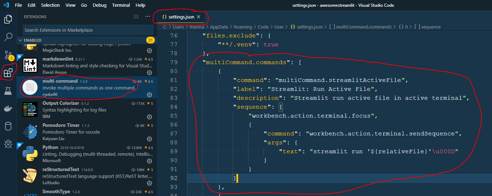

```json
{
    "command": "multiCommand.streamlitActiveFile",
    "label": "Streamlit: Run Active File",
    "description": "Streamlit run active file in active terminal",
    "sequence": [
        "workbench.action.terminal.focus",
        {
            "command": "workbench.action.terminal.sendSequence",
            "args": {
                "text": "streamlit run '${relativeFile}'\u000D"
            }
        }
    ]
},
```

Then you can execute your *streamlit run* command via the command palette (CTRL+SHIFT+P)

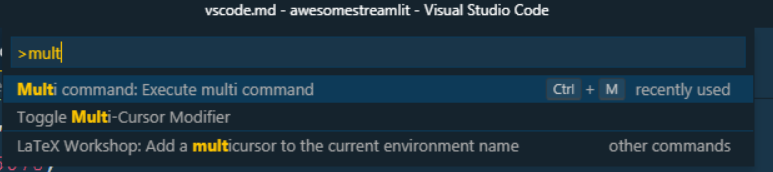

```json
{
    "key": "ctrl+m ctrl+s",
    "command": "multiCommand.streamlitActiveFile",
},
```

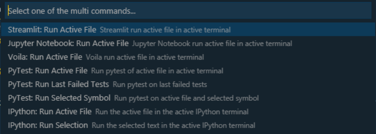

Or you can setup a keyboard shortcut in your keybindings.json file to run Streamlit


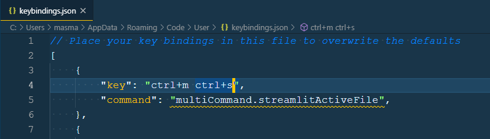

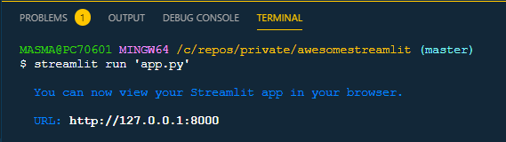

## Debugging

### Manual Debugging

You can **debug mannually** by inserting a `breakpoint()` (Python 3.7+) or `import pdb;pdb.set_trace()` (Python 3.6 or below) in your code.


### Integrated Debugging

You can also use the **integrated debugger** in VS Code via the [ptvsd](https://github.com/microsoft/ptvsd) Python package

Please note that [andaag](https://github.com/andaag) reported the below to not work on ubuntu 18.04.3 LTS with Python 3.6.8. He gets a `ValueError: signal only works in main thread` error. See [issue 648](https://github.com/streamlit/streamlit/issues/648). It's working really well for me on Windows with Python 3.7.4 though.

First you should `pip install ptvsd`.

Then you need to insert the following snippet in your `<your-app_name>.py` file.

```python
import ptvsd
ptvsd.enable_attach(address=('localhost', 5678))
ptvsd.wait_for_attach() # Only include this line if you always wan't to attach the debugger
```

Then you can start your Streamlit app

```bash
streamlit run <your-app_name>.py
```

Then you should configure your *Remote Attach: debug PTVSD option*

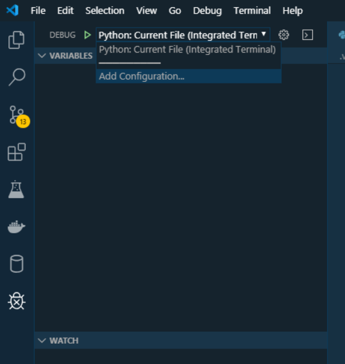

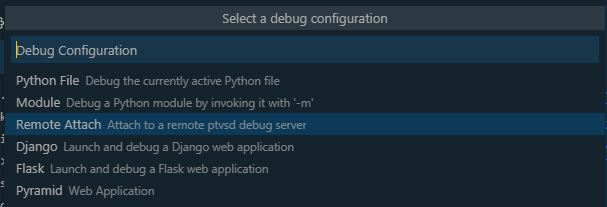

and update to the below in your launch.json file. Please make sure that you manually insert the *redirectOutput* setting below.

```json
{
    "name": "Python: Remote Attach",
    "type": "python",
    "request": "attach",
    "port": 5678,
    "host": "localhost",
    "justMyCode": true,
    "redirectOutput": true,
    "pathMappings": [
        {
            "localRoot": "${workspaceFolder}",
            "remoteRoot": "."
        }
    ]
}
```

Please note that by default you will be debugging your own code only.
If you wan't to debug into for example the streamlit code, then you can change the `justMyCode` setting from `true` to `false`.

Finally you can attach the debugger by clicking the debugger play button

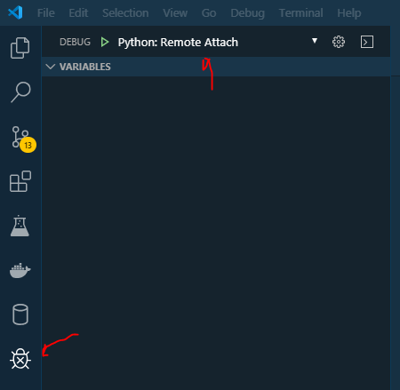

and you can debug away.

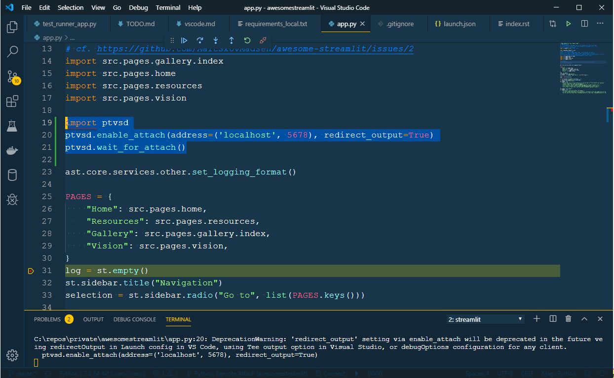

#### Using a ptvsd snippet

You can create a snippet in your `python.json` snippet configuration to insert the `import ptvsd...` code.

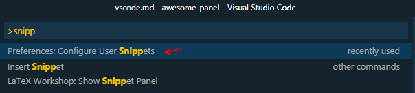

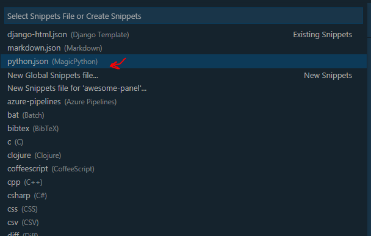

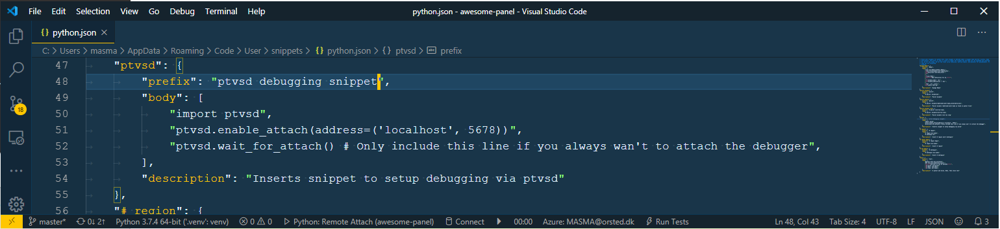

```typescript
"ptvsd": {
    "prefix": "ptvsd debugging snippet",
    "body": [
        "import ptvsd",
        "ptvsd.enable_attach(address=('localhost', 5678))",
        "print('Ready to attach the VS Code debugger')",
        "ptvsd.wait_for_attach() # Only include this line if you always wan't to attach the debugger",
    ],
    "description": "Inserts snippet to setup debugging via ptvsd"
},
```

#### Using a dedicated app_debug_vscode.py file for debugging

Adding and removing the *ptvsd* code above can be cumbersome. So a usefull trick is to setup a dedicated *app_debug_vscode.py* file for debugging.

Assuming your app.py file has a `def main():` function, then your *app_debug_vscode.py* file could look as follows

```python
"""Use this module for development with VS Code and the integrated debugger"""
import ptvsd
import streamlit as st

import app

# pylint: disable=invalid-name
markdown = st.markdown(
    """
## Ready to attach the VS Code Debugger!


for more info see the [VS Code section at awesome-streamlit.readthedocs.io]
(https://awesome-streamlit.readthedocs.io/en/latest/vscode.html#integrated-debugging)
"""
)


ptvsd.enable_attach(address=("localhost", 5678))
ptvsd.wait_for_attach()

markdown.empty()

app.main()
```

then you run `streamlit run app_debug_vscode.py` instead of `streamlit run app.py` and attach the debugger.

For a use case see my [app.py](https://github.com/MarcSkovMadsen/awesome-streamlit/blob/master/app.py) and [app_dev_vscode.py](https://github.com/MarcSkovMadsen/awesome-streamlit/blob/master/app_dev_vscode.py) files.

#### Using the integrated Debugging Console

When you are running your integrated debugging in VS Code, you can use the *Debugging Console* with
Streamlit if you `import streamlit as st`. Then you can write dataframes and charts to the browser window
and take a better look at your data, than you can in VS Code.


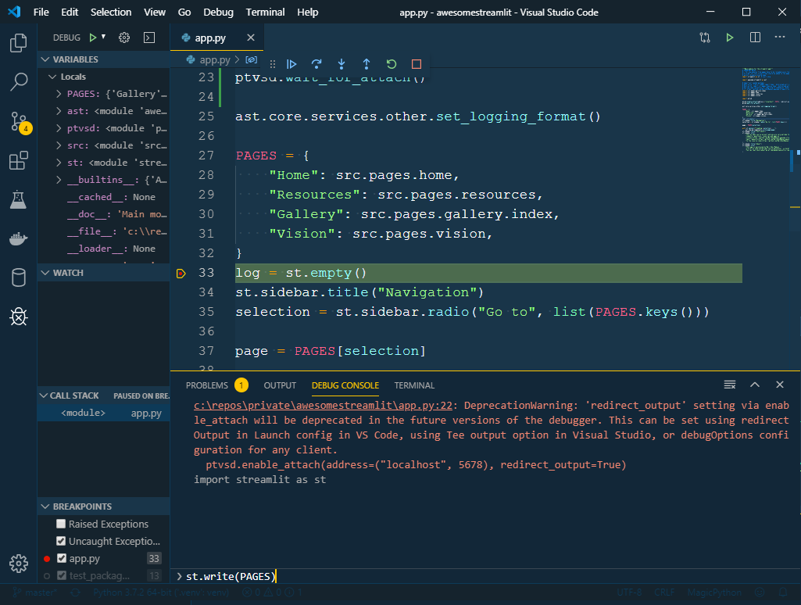
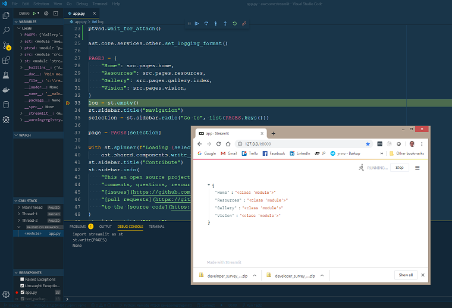

You should also remember to *print* your dataframes to the debugger console to get a nice formatting.

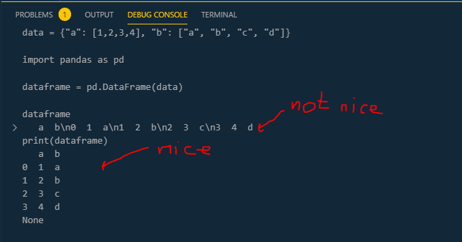

## Installing the Streamlit Repo for Development using Visual Studio Online

I would like to experiment with and maybe contribute to the [streamlit/streamlit](https://github.com/streamlit/streamlit) repo.

There is an official Streamlit [Contributing guide](https://github.com/streamlit/streamlit/wiki/Contributing) I can follow to get up and running.

But I'm running on Windows 8.1 so it's a it problematic getting it up and running.

- I cannot install directly on Windows because the Makefile and associated tools are very dependent on Linux.
- I cannot use *Visual Studio Code Remote - Containers* as described [here](https://code.visualstudio.com/docs/remote/containers) because it requires Windows 10 (not 8.1) and Docker (not Docker Toolbox)
- Maybe I could have installed Linux on my machine. But ...
- I guess I could install in a Docker container locally but not integrate with VS Code. But that would not be efficient.

I then settled on trying out the new [Visual Studio Online](https://visualstudio.microsoft.com/services/visual-studio-online/) experience. I got it working successfully after some time. Below I will describe the steps.

DISCLAIMER: THE BELOW WAS SO COMPLICATED AND HAD TO BE REPEATED SEVERAL TIMES THAT I CANNOT GUARENTEE THAT IT WILL WORK 100%. BUT I HOPE IT STILL HELPS A LOT.

IF SOMETHING GOES WRONG TAKE A LOOK AT THE TROUBLE SHOOTING SECTION BELOW.

### Forking the Streamlit Repo

Forking a repository is a simple two-step process.

1 On GitHub navigate to the [streamlit/streamlit](https://github.com/streamlit/streamlit) repository
2 In the top-right corner of the page, click Fork


That's it! Now I have a fork of the original streamlit/streamlit repository.

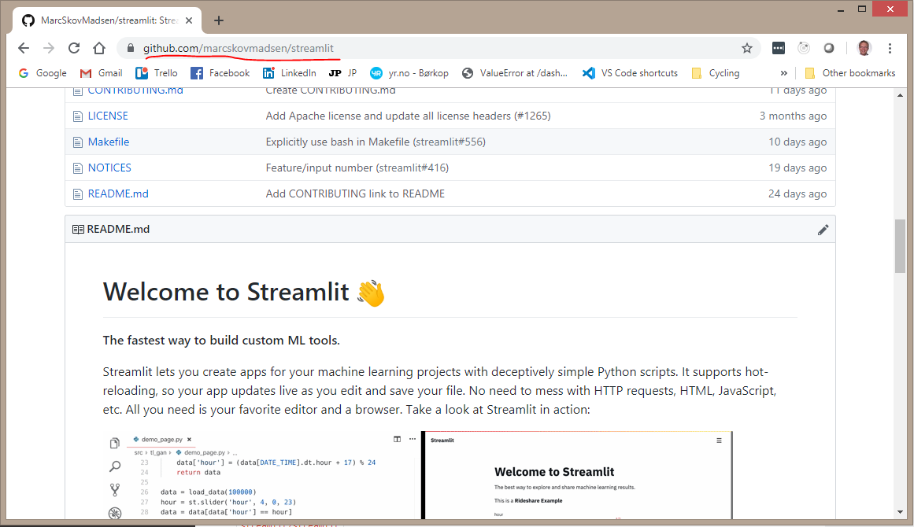

### Setting up the Streamlit Repo as a a Visual Studio Online Environment

Visual Studio Online is a new experiment for working in VS Code locally, but running everything inside a docker container environment in the cloud.

To create a docker container environment containing the streamlit repo I followed step 1-4 of the offical [VS Code Quickstart Guide](https://docs.microsoft.com/en-us/visualstudio/online/quickstarts/vscode). But I replaced the `microsoft/vsonline-quickstart` with `<my-user-name>/streamlit`.

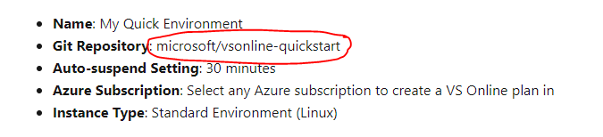

Finally the environment was created

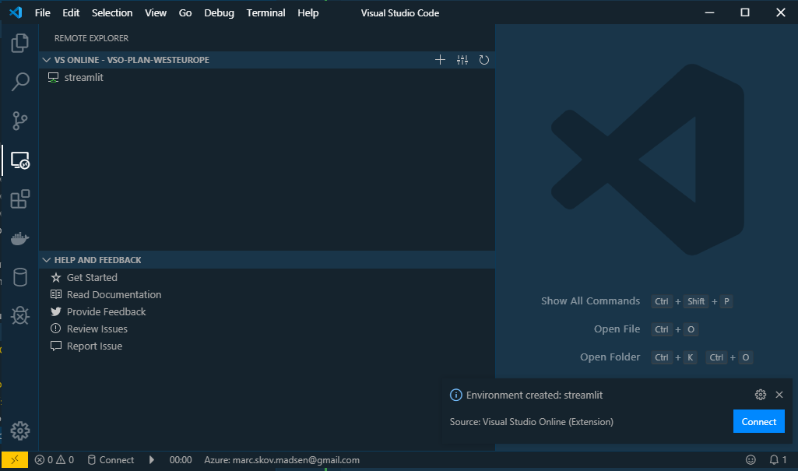

and I click the connect button and it connects.

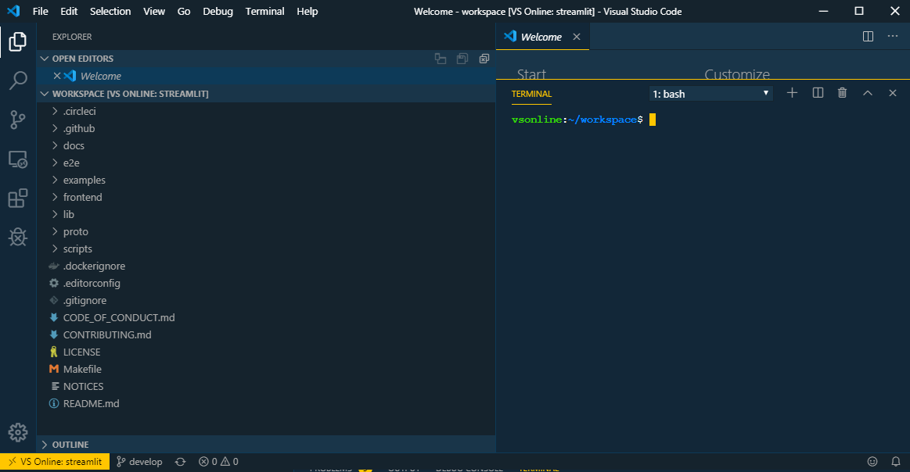

### Were running Python 3.5.3 on Debian!

It's nice to see what is in the environment

```bash
vsonline:~/workspace$ python
Python 2.7.13 (default, Sep 26 2018, 18:42:22)
[GCC 6.3.0 20170516] on linux2
Type "help", "copyright", "credits" or "license" for more information.
>>> exit()
vsonline:~/workspace$ python3
Python 3.5.3 (default, Sep 27 2018, 17:25:39)
[GCC 6.3.0 20170516] on linux
Type "help", "copyright", "credits" or "license" for more information.
>>> exit()
vsonline:~/workspace$ cat /etc/os-release
PRETTY_NAME="Debian GNU/Linux 9 (stretch)"
NAME="Debian GNU/Linux"
VERSION_ID="9"
VERSION="9 (stretch)"
VERSION_CODENAME=stretch
ID=debian
HOME_URL="https://www.debian.org/"
SUPPORT_URL="https://www.debian.org/support"
BUG_REPORT_URL="https://bugs.debian.org/"
vsonline:~/workspace/Python-3.7.4$ nproc
4
```

### Set Up My Base Environment

I then followed the [Ubuntu](https://github.com/streamlit/streamlit/wiki/Contributing#ubuntu) section with

- `sudo apt install graphviz python3-distutils` replaced by `sudo apt install graphviz`
  - See the troubleshouting guide wrt `python3-distutils`.
- and pyenv added to the path of the ~/.bashrc file

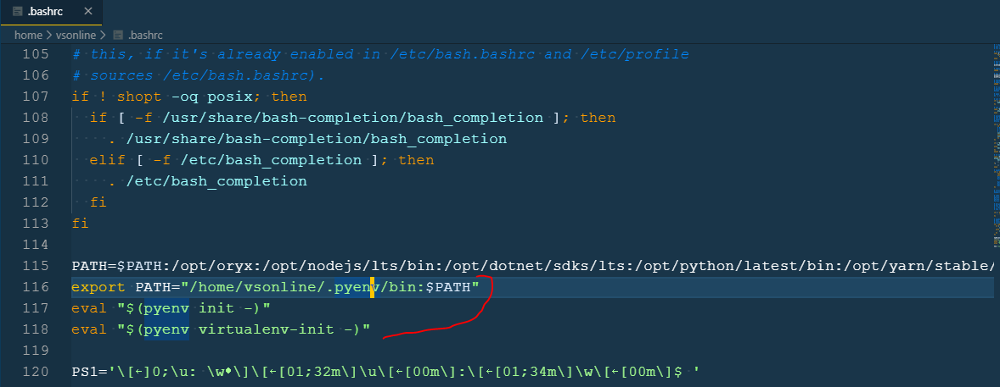

### Installing Python 3.7.4

I used pyenv to install Python 3.7.4

```bash
vsonline:~/workspace/lib$ pyenv install 3.7.4
```

### Grab the code

Nothing to do here as it's already installed.

### Create a new Python environment

```bash
vsonline:~/workspace/lib$ pyenv global 3.7.4
vsonline:~/workspace/lib$ python3
Python 3.7.4 (default, Nov 10 2019, 11:50:45)
[GCC 6.3.0 20170516] on linux
Type "help", "copyright", "credits" or "license" for more information.
>>> exit()
vsonline:~/workspace/lib$ python3 -m venv ~/.venv
vsonline:~/workspace/lib$ source ~/.venv/bin/activate
```

```bash
(.venv) vsonline:~/workspace/lib$ pipenv install
Creating a virtualenv for this project…
Pipfile: /home/vsonline/workspace/lib/Pipfile
Using /home/vsonline/.pyenv/versions/3.7.4/bin/python3.7 (3.7.4) to create virtualenv…
⠼ Creating virtual environment...Already using interpreter /home/vsonline/.pyenv/versions/3.7.4/bin/python3.7
Using base prefix '/home/vsonline/.pyenv/versions/3.7.4'
New python executable in /home/vsonline/.local/share/virtualenvs/lib-vom9Vlgm/bin/python3.7
Also creating executable in /home/vsonline/.local/share/virtualenvs/lib-vom9Vlgm/bin/python
Installing setuptools, pip, wheel...
done.

✔ Successfully created virtual environment!
Virtualenv location: /home/vsonline/.local/share/virtualenvs/lib-vom9Vlgm
```

activate the environment

```bash
pipenv shell
```

### Onetime setup

Disable Tensorflow in the Pipfile

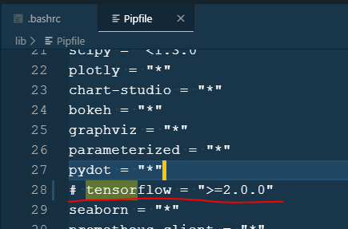

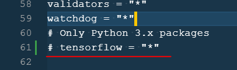

and install it manually

```bash
pip install tensorflow>=2.0.0
```

then run

```bash
make all-devel
```

### Start the dev server

I just followed the steps in the Contributing guide

### Run Streamlit

I just followed the steps in the Contributing guide and the servers are running.

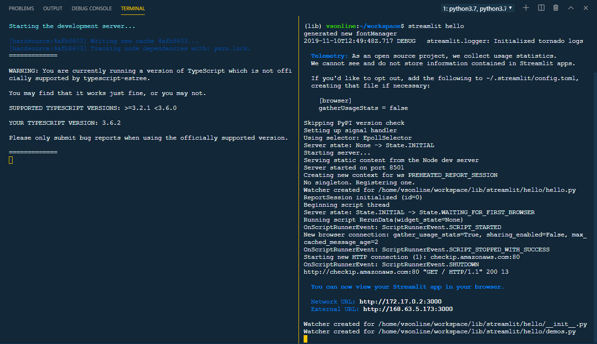

### Forwarding the ports

In order to open Streamlit in your browser you need to forward the ports 3000 and 8501.

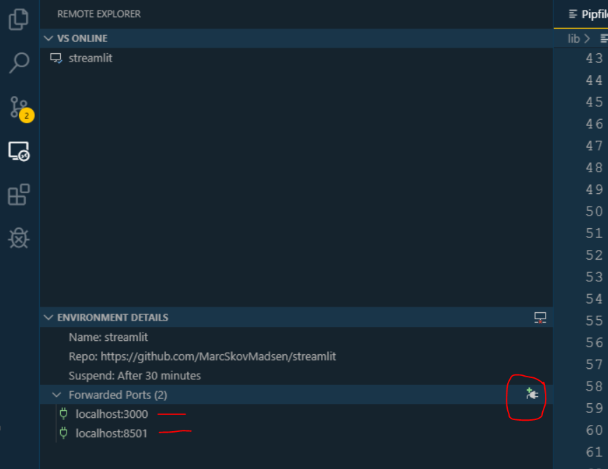

### Streamlit hello

And finally it works

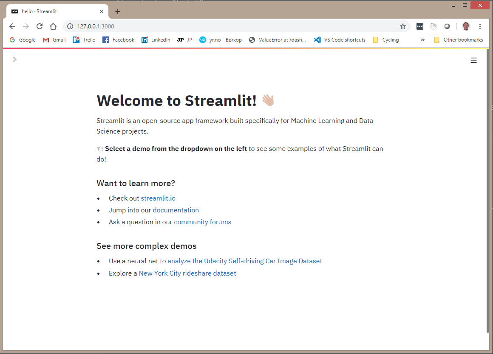

### Troubleshooting

#### Connecting to the Remote Never Finishes

Sometimes VS Code cannot open the remote. I've filed an issue at [MicrosoftDocs/vsonline issue #153](https://github.com/MicrosoftDocs/vsonline/issues/153)

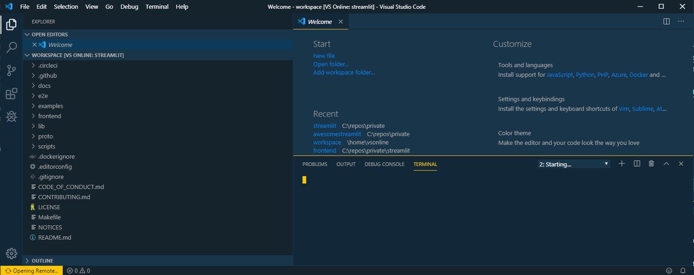

I have experienced a few times that if I **Toggle Developer Tools** under the Help menu item then it starts reconnecting and succeeds. Strange :-)

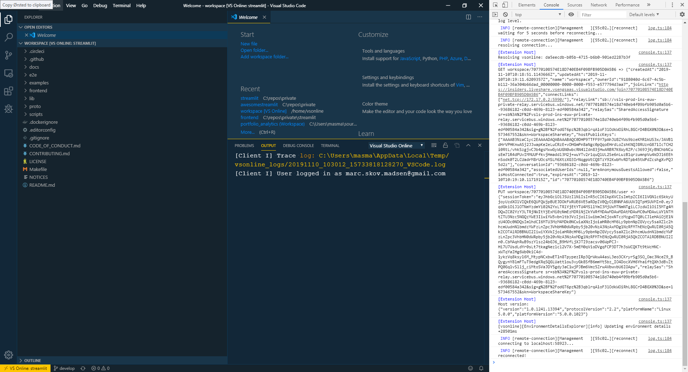

#### The Contributing Guide Does Not Work for me

I could not exactly follow the [Contributing guide](https://github.com/streamlit/streamlit/wiki/Contributing). I've filed the issues I saw as [streamlit/streamlit issue #665](https://github.com/streamlit/streamlit/issues/665).

#### Build Python3.7.4 from scratch

At some stage i could not get pyenv to work. So I followed the [How to Install Python 3.7 on Debian 9 Guide](https://linuxize.com/post/how-to-install-python-3-7-on-debian-9/) with

- `3.7.3` replaced by `3.7.4`.
- `make -j 8` replaced by `make -j 4`

Please note that there will be **plenty of time for coffea** as the installation and tests take 30 minutes!

After verifying the installation I removed the temporary `Python-3.7.4.tar.xz` file and `Python-3.7.4` folder.

```bash
rm Python-3.7.4.tar.xz
sudo rm -rf Python-3.7.4
```

#### Package python3-distutils is not Available

Maybe because of building 3.7.4 from scratch I ran into

```bash
vsonline:~/workspace$ sudo apt install python3-distutils
Reading package lists... Done
Building dependency tree
Reading state information... Done
Package python3-distutils is not available, but is referred to by another package.
This may mean that the package is missing, has been obsoleted, or
is only available from another source
However the following packages replace it:
  libpython3.7-stdlib

E: Package 'python3-distutils' has no installation candidate
vsonline:~/workspace$ sudo apt install libpython3.7-stdlib
Reading package lists... Done
Building dependency tree
Reading state information... Done
Package libpython3.7-stdlib is not available, but is referred to by another package.
This may mean that the package is missing, has been obsoleted, or
is only available from another source
However the following packages replace it:
  idle-python3.7 python3-tk python3-lib2to3 python3-distutils

E: Package 'libpython3.7-stdlib' has no installation candidate
vsonline:~/workspace$ sudo apt install idle-python3.7 python3-tk python3-lib2to3 python3-distutils
Reading package lists... Done
Building dependency tree
Reading state information... Done
Package python3-distutils is not available, but is referred to by another package.
This may mean that the package is missing, has been obsoleted, or
is only available from another source
However the following packages replace it:
  libpython3.7-stdlib

Package python3-lib2to3 is not available, but is referred to by another package.
This may mean that the package is missing, has been obsoleted, or
is only available from another source

Package idle-python3.7 is not available, but is referred to by another package.
This may mean that the package is missing, has been obsoleted, or
is only available from another source

E: Package 'idle-python3.7' has no installation candidate
E: Package 'python3-lib2to3' has no installation candidate
E: Package 'python3-distutils' has no installation candidate
```

#### Makefile:46: recipe for target 'pipenv-install' failed

When running

```bash
make all-devel
```

I get the below error.

```bash
pip/_internal/utils/misc.py", line 703, in call_subprocess
    raise InstallationError(
pipenv.patched.notpip._internal.exceptions.InstallationError: Command "python setup.py egg_info" failed with error code 1 in /tmp/tmp5wxfmdotbuild/functools32/
Makefile:46: recipe for target 'pipenv-install' failed
make: *** [pipenv-install] Error 1
```

The root cause is Tensorflow. Tensorflow does not support installation with pipenv according to [pyp/pipenv issue #2619](https://github.com/pypa/pipenv/issues/2619) and similar issues.

The solution is to remove it from the Piplock File and install it manually

```bash
pip install tensorflow>=2.0.0
```


